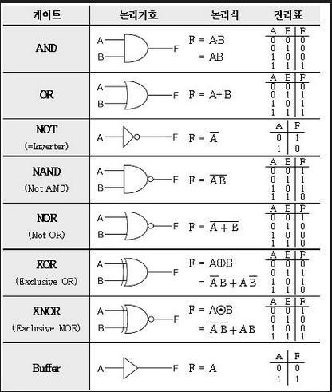

# STEP1. 디지털 논리회로

## 기본 논리 회로

## NAND 게이트
- not and 의 줄임말
~~~
int x,y,z;
boolean a,b,c;

System.out.println(" x | y | z |");
System.out.println("---|---|---|");

for(int i = 0; i < 2; i++) {
  for(int j = 0; j < 2; j++) {
    x = i; y = j;
    a = (x != 0); b = (y!= 0);
    c = !(a&&b); //!(AB)
    z = (c)? 1:0;

    System.out.println(" "+x+" | "+y+" | "+z+" | ");
  }
}

// 			result
//	    x | y | z |
//     ---|---|---|
//		  0 | 0 | 1 |
//		  0 | 1 | 1 |
//		  1 | 0 | 1 |
//		  1 | 1 | 0 |
~~~

## NOR 게이트
- not or 의 줄임
~~~
int x,y,z;
boolean a,b,c;

System.out.println(" x | y | z |");
System.out.println("---|---|---|");

for(int i = 0; i < 2; i++) {
  for(int j = 0; j < 2; j++) {
    x = i;  y = j;
    a = (x != 0); b = (y!= 0);
    c = !(a||b); // !(A+B)
    z = (c)? 1:0;

    System.out.println(" "+x+" | "+y+" | "+z+" | ");
  }
}

//   		result
//   	  x | y | z |
//		 ---|---|---|
//		  0 | 0 | 1 |
//		  0 | 1 | 0 |
//		  1 | 0 | 0 |
//		  1 | 1 | 0 |
~~~
## XOR 게이트
- a,b 중 하나만 ture 일때 ture 리턴
~~~
int x,y,z;
boolean a,b,c;

System.out.println(" x | y | z |");
System.out.println("---|---|---|");

for(int i = 0; i < 2; i++) {
  for(int j = 0; j < 2; j++) {
    x = i;  y = j;
    a = (x != 0); b = (y!= 0);
    c = !a&&b||a&&!b; // !AB+
    z = (c)? 1:0;

    System.out.println(" "+x+" | "+y+" | "+z+" | ");
  }
}
//			result
//		  x | y | z |
//		 ---|---|---|
//		  0 | 0 | 0 |
//		  0 | 1 | 1 |
//		  1 | 0 | 1 |
//		  1 | 1 | 0 |
~~~

## 이진덧셈기
### 배경지식
1. 반가산기  

2. 전가산기  

### 미션1
- boolean 타입으로 동작하는 이진 덧셈기를 논리게이트 동작만으로 구현합니다.
~~~
public class adder {

    public static boolean[] halfadder(boolean bitA, boolean bitB) {
        boolean[] answer = new boolean[2];
        answer[0] = bitA&&bitB;                // carry
        answer[1] = !bitA&&bitB||bitA&&!bitB;  // sum

        return answer;
    }
    public static boolean[] fulladder(boolean bitA, boolean bitB, boolean carry) {
        boolean[] answer = new boolean[2];
        //carry 논리연산식
//        answer[0] = bitA&&bitB||bitB&&carry||bitA&&carry ;
        //sum 논리연산식
//        answer[1] = bitA&&bitB&&carry||!bitA&&!bitB&&carry||!bitA&&bitB&&!carry||bitA&&!bitB&&!carry;

        //carry halfadder 메소드 호출
        answer[0] = halfadder(bitA,bitB)[0]||halfadder(carry,halfadder(bitA,bitB)[0])[0] ;
        //sum halfadder 메소드 호출
        answer[1] = halfadder(carry,(halfadder(bitA,bitB)[1]))[1];

        return answer;
    }

	public static void main(String[] args) {

		int x,y,z,c,s;
		boolean a,b,d,e,f;

		// halfadder 진리표 출력
		System.out.println("half adder truth table");
		System.out.println(" x | y | c | s ");
		System.out.println("---|---|---|---");
		for(int i = 0; i < 2; i++) {
			for(int j = 0; j < 2; j++) {
				x = i;  y = j;
				a = (x!= 0);  b = (y!= 0);
				d = halfadder(a,b)[0];
				e = halfadder(a,b)[1];
				c = (d)? 1:0; s = (e)? 1:0;

				System.out.println(" "+x+" | "+y+" | "+c+" | "+s);
			}
		}

		// fulladder 진리표 출력
		System.out.println("full adder truth table");
		System.out.println(" x | y | z | c | s ");
		System.out.println("---|---|---|---|---");

		for(int i = 0; i < 2; i++) {
			for(int j = 0; j < 2; j++) {
				for(int k = 0; k<2; k++) {
					x = i; y = j;  z = k;
					a = (x!= 0); b = (y!= 0);  d = (z!= 0);
					e = fulladder(a,b,d)[0];
					f = fulladder(a,b,d)[1];
					c = (e)? 1:0;  s = (f)? 1:0;

					System.out.println(" "+x+" | "+y+" | "+z+" | "+c+" | "+s);

				}
			}
		}
    //result
//		half adder truth table
//		 x | y | c | s
//		---|---|---|---
//		 0 | 0 | 0 | 0
//		 0 | 1 | 0 | 1
//		 1 | 0 | 0 | 1
//		 1 | 1 | 1 | 0
//		full adder truth table
//		 x | y | z | c | s
//		---|---|---|---|---
//		 0 | 0 | 0 | 0 | 0
//		 0 | 0 | 1 | 0 | 1
//		 0 | 1 | 0 | 0 | 1
//		 0 | 1 | 1 | 0 | 0
//		 1 | 0 | 0 | 0 | 1
//		 1 | 0 | 1 | 0 | 0
//		 1 | 1 | 0 | 1 | 0
//		 1 | 1 | 1 | 1 | 1
	}
}
~~~

### 미션2
앞에서 만든 전가산기 반가산기를 이용해서 BOOL타입으로 동작하는 8비트 덧셈기를 구현한다.
- 바이트 덧셈(byteadder) : 8비트를 BOOL타입 배열로 2개를 입력 받는다.
- 자리올림(carry) + 전체 합(sum)을 순서대로 배열로 담아서 리턴하는 함수를 구현한다.
- 입력으로 들어오는 byteA, byteB 배열의 길이는 같다고 가정한다.
- 입력으로 들어오는 byteA 비트 순서는 낮은 자리가 배열의 앞쪽에 오도록 표현한다. 배열의 순서대로 보면 이진수가 뒤집혀 있는 것처럼 보인다고 가정한다.

*이진수 1100 = [ 0, 0, 1, 1 ] 이진수 0101 = [ 1, 0, 1, 0 ]*

~~~
public class binaryAdder {

	public static boolean[] halfadder(boolean bitA, boolean bitB) {
	        boolean[] answer = new boolean[2];
	        answer[0] = bitA&&bitB;                // carry
	        answer[1] = !bitA&&bitB||bitA&&!bitB;  // sum

	        return answer;
	    }

	  public static boolean[] fulladder(boolean bitA, boolean bitB, boolean carry) {
	        boolean[] answer = new boolean[2];
	        answer[0] = bitA&&bitB||bitB&&carry||bitA&&carry ;
	        answer[1] = bitA&&bitB&&carry||!bitA&&!bitB&&carry||!bitA&&bitB&&!carry||bitA&&!bitB&&!carry;

	        return answer;
	    }

	public static boolean[] byteadder(boolean[] byteA, boolean[] byteB) {
	        boolean[] answer = new boolean[byteA.length+1];
	        int len = byteA.length;
	        boolean c = true;

	        for(int i = 0 ; i <= len; i++) {
	        	if(i == 0) {
	        		answer[i] = halfadder(byteA[i],byteB[i])[1];
	        		c = halfadder(byteA[i],byteB[i])[0];
	        	}else if(i == len) {

	        	answer[i] = c;

	        	}else {
	        		answer[i] = fulladder(byteA[i],byteB[i],c)[1];
	        		c = fulladder(byteA[i],byteB[i],c)[0];

	        	}

	        }

	        return answer;
	    }

	public static void main(String[] args) {

		int [] A = { 1, 1, 0, 0, 1, 0, 1, 0 };
		int [] B = { 1, 1, 0, 1, 1, 0, 0, 1 };

		boolean[] a = new boolean[A.length];
		boolean[] b = new boolean[B.length];

		for(int i = 0; i< A.length; i++) {
			a[i] = (A[i]!=0);
			b[i] = (B[i]!=0);
		}

		boolean[] c = new boolean[a.length+1];

		c = byteadder(a,b);
		for(int i = 0; i< c.length;i++) {
			if(i ==0) {
				System.out.print("["+(c[i]? 1:0)+",");
			}else if(i == c.length-1) {
				System.out.print((c[i]? 1:0)+"]");
			}else{
				System.out.print((c[i]? 1:0)+",");
			}
		}
	}
}
~~~

#### 정리
- 4비트나 16비트도 같은 함수로 처리 가능한가?
입력받은 배열의 길이로 함수를 처리하게 했기 때문에 가능
- byteA와 byteB 배열의 크기가 다르면 어떻게 처리 가능할까?
배열은 크기가 고정되므로 크기를 바꿔주기위해 입력받는 배열을 arryList로 변경해줌

~~~
public static void main(String[] args) {

  ArrayList<Integer> A = new ArrayList<Integer>(
        Arrays.asList(1, 1, 0, 0, 1, 0, 1, 0 ));
    ArrayList<Integer> B = new ArrayList<Integer>(
        Arrays.asList(1, 1, 0, 0, 1, 0, 1, 0 ));

    int length = A.size();

    if(A.size() != B.size()) {
      length = Math.max(A.size(),B.size());
      if(A.size() < length) {
        for(int i = A.size(); i < length ; i++) {
          A.add(i,0);
        }
      }else {
        for(int i = B.size(); i < length ; i++) {
          B.add(i,0);
        }

      }

    }

    boolean[] a = new boolean[length];
    boolean[] b = new boolean[length];

    for(int i = 0; i< length; i++) {
      a[i] = (A.get(i)!=0);
      b[i] = (B.get(i)!=0);
    }

  boolean[] c = new boolean[a.length+1];

  c = byteadder(a,b);
  for(int i = 0; i< c.length;i++) {
    if(i ==0) {
      System.out.print("["+(c[i]? 1:0)+",");
    }else if(i == c.length-1) {
      System.out.print((c[i]? 1:0)+"]");
    }else{
      System.out.print((c[i]? 1:0)+",");
    }
  }
}
~~~

#### 추가수정
- and or xor 게이트 함수를 작성하고 그 함수들을 호출하도록 코드를 작성했다.
~~~
import java.util.ArrayList;
import java.util.Arrays;

public class binaryAdder {

	public static boolean andG(boolean a, boolean b) {
		boolean answer = a&&b;
		return answer;
	}
	public static boolean orG(boolean a, boolean b) {
		boolean answer = a||b;
		return answer;
	}
	public static boolean xorG(boolean a, boolean b) {
		boolean answer;
		
		answer = orG(andG(!a,b),andG(a,!b));
		
		return answer;
	}

	public static boolean[] halfadder(boolean a, boolean b) {
	        boolean[] answer = new boolean[2];
	        
	        answer[0] = andG(a,b);
	        answer[1] = xorG(a,b);

	        return answer;
	}
	
	public static boolean[] fulladder(boolean a, boolean b, boolean c) {
	        boolean[] answer = new boolean[2];
	        
	        answer[0] = orG(halfadder(a,b)[0], halfadder(c,halfadder(a,b)[1])[0]);
	        answer[1] = halfadder(c,halfadder(a,b)[1])[1];
	        
	        
	        return answer;
	}

	public static boolean[] byteadder(boolean[] byteA, boolean[] byteB) {
	        boolean[] answer = new boolean[byteA.length+1];
	        int len = byteA.length;
	        boolean c = true;

	        for(int i = 0 ; i <= len; i++) {
	        	if(i == 0) {
	        		answer[i] = halfadder(byteA[i],byteB[i])[1];
	        		c = halfadder(byteA[i],byteB[i])[0];
	        	}else if(i == len) {

	        	answer[i] = c;

	        	}else {
	        		answer[i] = fulladder(byteA[i],byteB[i],c)[1];
	        		c = fulladder(byteA[i],byteB[i],c)[0];

	        	}

	        }

	        return answer;
	    }

	public static void main(String[] args) {

		ArrayList<Integer> A = new ArrayList<Integer>(
			Arrays.asList(1, 1, 0, 0, 1, 0, 1, 0 ));
		ArrayList<Integer> B = new ArrayList<Integer>(
			Arrays.asList(1, 1, 0, 1, 1, 0, 0, 1 ));

  		int length = A.size();

  		if(A.size() != B.size()) {
  			length = Math.max(A.size(),B.size());
  			if(A.size() < length) {
  				for(int i = A.size(); i < length ; i++) {
  					A.add(i,0);
  				}
  			}else {
  				for(int i = B.size(); i < length ; i++) {
  					B.add(i,0);
  				}

  			}

  		}

  		boolean[] a = new boolean[length];
  		boolean[] b = new boolean[length];

  		for(int i = 0; i< length; i++) {
  			a[i] = (A.get(i)!=0);
  			b[i] = (B.get(i)!=0);
  		}

		boolean[] c = new boolean[a.length+1];

		c = byteadder(a,b);
		for(int i = 0; i< c.length;i++) {
			if(i ==0) {
				System.out.print("["+(c[i]? 1:0)+",");
			}else if(i == c.length-1) {
				System.out.print((c[i]? 1:0)+"]");
			}else{
				System.out.print((c[i]? 1:0)+",");
			}
		}
	}
}

~~~

## 진법변환기
1. 미션1
- int 정수형 10진수를 bool 2진수 배열로 변환하는 dec2bin함수를 구현한다
- *코드 간결화를 위해 2진수 배열을 arrayList로 변경해 작성했다*

~~~
import java.util.Scanner;

public class convertor {
	public static ArrayList dec2bin(int decimal) {
		ArrayList<Integer> answer = new ArrayList();
		int a = decimal;
		int r;	
		for(int i = 0; a!=1; i++) {
			r = a%2;
			a = a/2;
			answer.add(r);
			if(a == 1) {
				answer.add(a);
			}
		}
        return answer;
    }
	
	public static void main(String[] args) {
		Scanner sc = new Scanner(System.in);		
		int a = sc.nextInt();
		
		ArrayList<Integer> ans = new ArrayList();
		
		ans = dec2bin(a);
		Iterator itr = ans.iterator();
		
		while(itr.hasNext()) {
			System.out.print(itr.next());
		}
	}
}
~~~

2. 미션2
- 2진수 를 10진수로 변환하는 bin2dec함수를 구현한다.
-*입력과 출력을 연결하고 (입력)10진법 -> (출략)2진법 -> (출력)10진법 으로 구현했다*
~~~
import java.util.Scanner;

public class convertor {
	public static ArrayList dec2bin(int decimal) {
		ArrayList<Integer> answer = new ArrayList();
		int a = decimal;
		int r;	
		for(int i = 0; a!=1; i++) {
			r = a%2;
			a = a/2;
			answer.add(r);
			if(a == 1) {
				answer.add(a);
			}
		}
        return answer;
    }

    public static int bin2dec(ArrayList bin) {
		int answer = 0;
		int a = 1;
		for(int i = 0; i < bin.size(); i++) {
			answer = answer + (int)bin.get(i)*a;
			a =a*2;
			
		}
		return answer;
	}
	
	public static void main(String[] args) {
		Scanner sc = new Scanner(System.in);		
		int a = sc.nextInt();
		
		ArrayList<Integer> ans = new ArrayList();
		
		ans = dec2bin(a);
		Iterator itr = ans.iterator();
		
		while(itr.hasNext()) {
			System.out.print(itr.next());
		}
		System.out.println();
		System.out.println(bin2dec(ans));
	}

}
~~~