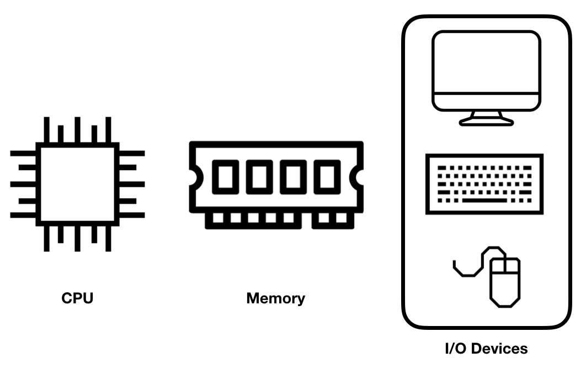
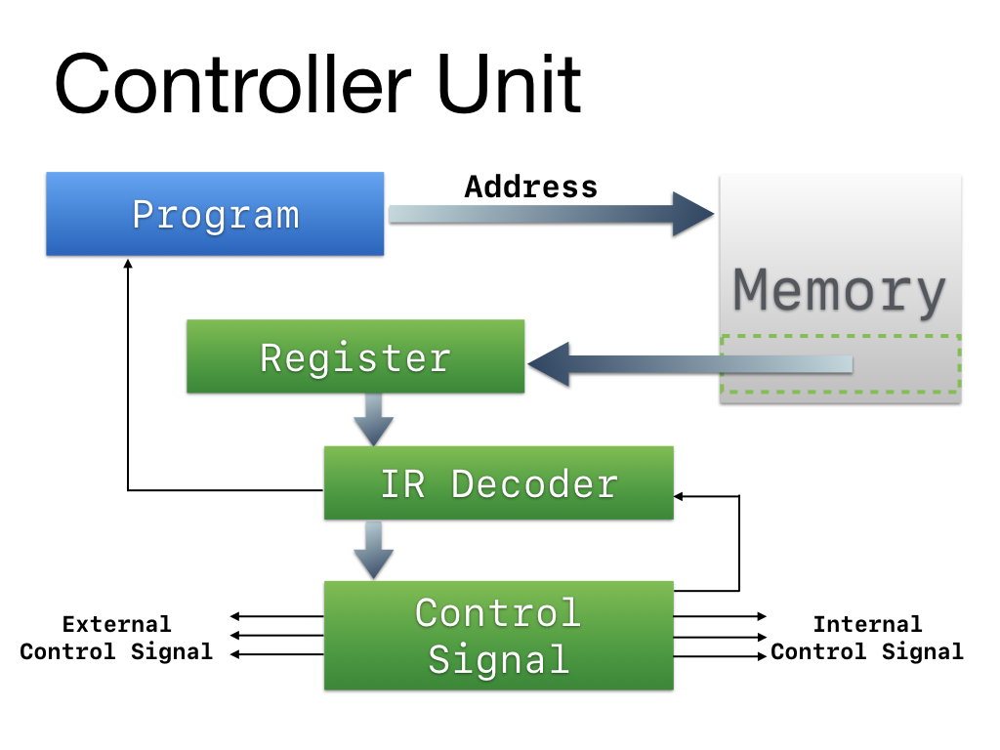
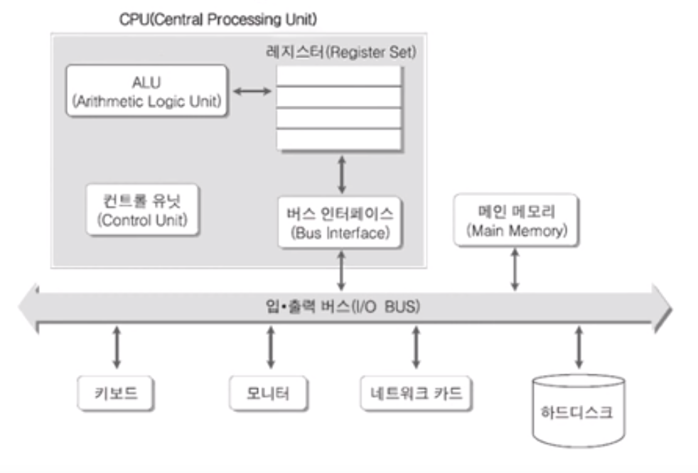
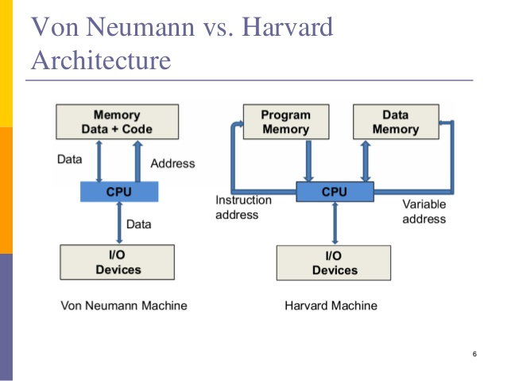
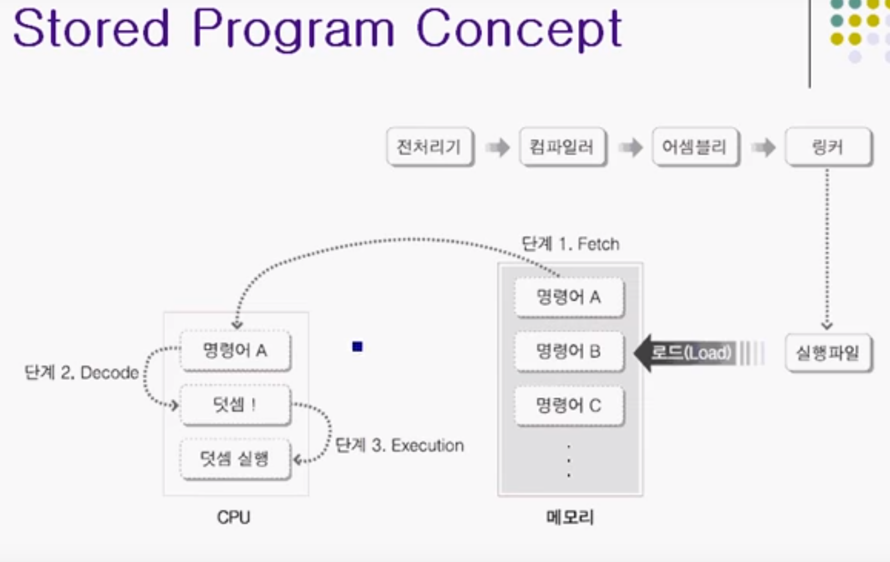
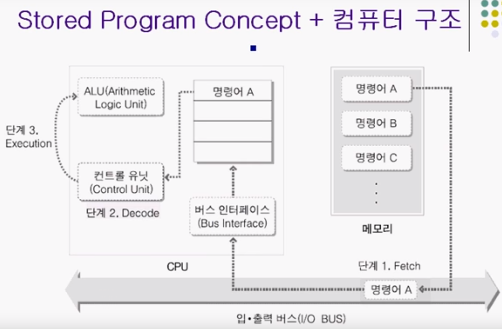

# Step2. 컴퓨터 시뮬레이터

## 컴퓨터 3요소

---

1. 메모리 

   - 데이터와 프로그램을 저장한다

   - 효율적인 동작을 위해 여러 계층으로 나누어져 있다

     

     

     

     1. 코드(code) 영역

        - 실행할 프로그램의 코드가 저장되는 영역

     2. 데이터(data) 영역

        - 프로그램의 전역변수와 정적변수가 저장되는 영역
        - 프로그램의 시작과 함께 할당되며 종료되면 소멸한다

     3. 스택(stack) 영역

        - 함수의 호출과 관계되는 지역변수와 매개변수가 저장되는 영역
        - 함수의 호출과 함께 할당, 함수 호출 완료시 소멸
        - 이렇게 스택에 저장되는 함수의 호출정보를 스택프레임(stack frame)이라고 한다
        - 후입선출(LIFO), push와 pop으로 동작
        - 메모리의 높은주소에서 낮은주소 방향으로 할당

     4. 힙(heap) 영역

        - 사용자가 직접관리 할수있는(해야만하는) 메모리 영역
        - 사용자에 의해 메모리공간이 동적으로 할당되고 해제된다
        - 낮은주소에서 높은주소 방향으로 할당

        

2. CPU

   

   

   

   - 메모리에 있는 프로그램을 정해진 절차대로 실행하는 중앙 처리장치

   - 제조사마다 다른 동작 방식으로 구현되어 있지만, 기본적인 동작 흐름은 비슷하다.

     

     #### ex)

     1. 2+5를 하드디스크에 저장
     2. 메모리에 +와 2,5 저장
     3. 버스를 통해 버스인터페이스로 +,2,5 이동
     4. ALU가 필요할때 가져갈 수 있게 레지스터에 저장
     5. 컨트롤 유닛(brain)에서 판단해서 +,2,5를 ALU로 이동하도록 지시
     6. 결과를 레지스터로 저장

3. Input/ Output

   - 입력장치 : 메모리에 저장된 프로그램, 프로그램을 처리하는 프로세스의 동작에 영향을 주는것
   - 출력장치 : 처리 결과를 표시하는곳

   

## 메모리 만들기

---

메모리 역할

- 실행할 프로그램을 저장하고 있고, 읽고 쓰는 데이터를 쓰기도 한다.

#### 폰노이만 구조 vs 하버드구조

###### 하버드 구조

- 메모리가 물리적으로 분리
- 장점 : 속도가 빠름
- 단점 : 구성에 비용이 많이들고 복잡

###### 폰노이만 구조

- 메모리가 물리적으로 분리되어있지 않음
- 데이터 저장, 명령어 처리 전부 동작
- 프로그램 메모리와 데이터 메모리가 구분되어 있지 않고 하나의 버스를 가지고 있음
- 단점 : 메모리 속박 문제 및 병목 문제를 가짐
- 장점 : 하드웨어적 재배치 없이 소프트웨어 교체 만으로 새로운 작업들을 할수있다

## CPU 만들기

---

### CPU 역할

- 메모리에 저장된 프로그램을 차례대로 fetch 해서 해당 명령어를 decode해서 실행 excute 하는 역할을 담당한다

### cpu 구조

- CPU는 여러 종류 Register 와 계산을하는 ARU(계산유닛), 명령을처리하는 파이프라인으로 구성된다

- Stored program Concept , 폰노이만 아키텍쳐

  - 명령어는 메모리에 저장이 되어서 CPU에 1) Fetch되고 2) Decode 되고 3) Execution 되어야 한다
  - Fetch : CPU 내부로 명령어 이동
  - Decode : 명령어 해석 / 컨트롤유닛
  - Execution : 연산을 진행 / ALU중심으로 요소들의 협력으로 이루어진다 (보통은 ALU를 생각)

  

  

​    

## Reference

[TCP School](http://tcpschool.com/c/c_memory_structure)

[Nextstep](https://nextstep.camp/)

[cloudstudying](https://cloudstudying.kr/lectures/183)

[spiroprojects](http://spiroprojects.com/blog/cat-view-more.php?blogname=Difference-Between-Von-Neumann-Architecture-and-Harvard-Architecture&id=130)

[뇌를 자극하는 윈도우즈 시스템 프로그래밍](https://www.youtube.com/watch?v=GVX-m3RF-K0&list=PLVsNizTWUw7E2KrfnsyEjTqo-6uKiQoxc)

[https://synapticlab.co.kr](https://synapticlab.co.kr/52)